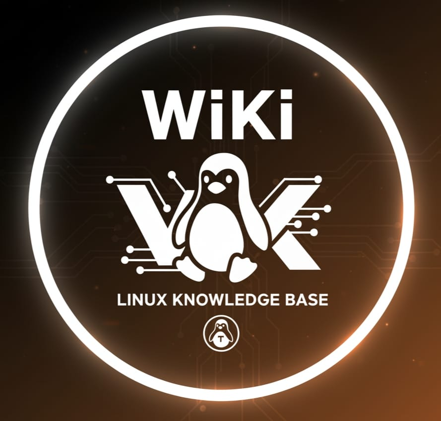

# 🐧 The Linux Wiki — Built by Learners, for Learners

> _“Understanding Linux is not a task — it’s a journey we take together.”_

Welcome to **The Linux Wiki**, a living hub built from real notes, experiments, and experiences — collected, written, and refined by developers, students, sysadmins, and enthusiasts.

This project began as personal notes — and grew into a **community knowledge space** for everyone who wants to:
- **Understand** Linux deeply — from system internals to DevOps automation  
- **Fix** real-world issues — from boot errors to networking problems  
- **Build** tools, scripts, and systems using Linux as a foundation  
- **Share** what they learn and contribute back to others

---

## 🌍 Our Mission

> To make Linux knowledge open, structured, and practical — not lost in chat logs or random posts.

We aim to:
- Gather **verified, real-world Linux knowledge**  
- Present it in a **clear, structured Markdown format**  
- Cover **system architecture, embedded Linux, DevOps**, and more  
- Encourage **continuous contribution** — your knowledge matters  

Some sections are still under construction — **you can help complete them!**

---

## 🧭 Wiki Structure

| Section | Status | Description |
|----------|--------|-------------|
| 🧱 **Linux Basics** | ✅ Ready | Shell, filesystem, permissions, processes |
| ⚙️ **System Internals** | ⚠️ Partial | Kernel, memory, scheduling, DBus, systemd _(help us expand!)_ |
| 🚀 **DevOps & Automation** | ⚠️ Partial | Docker, CI/CD, Ansible, automation _(contribute your notes!)_ |
| 🧩 **System Administration** | ⚠️ Partial | Users, services, networking, logs _(coming soon)_ |
| 🧯 **Common Issues & Fixes** | ⚠️ Partial | Real-world problems & solutions _(share your fixes!)_ |
| 🧠 **Concepts & Components** | ⚠️ Partial | systemd, udev, init, DBus, Wayland _(help us document!)_ |
| ⚡ **Embedded & Low-Level Linux** | ⏳ Soon | Bootloaders, device trees, kernel configs _(contributors needed!)_ |
| 🧰 **Development & Debugging** | ⏳ Soon | Tools, debugging, tracing, system programming |
| 📚 **References & Resources** | ✅ Ready | Books, articles, tools, contributors |

> Sections marked ⚠️ or ⏳ are **works in progress** — we welcome your contributions!  

  <a href="./linux-basics/" class="section-tile">
    <h3>🧱 Linux Basics</h3>
    
Shell, filesystem, permissions, processes

  </a>
  <a href="./system-internals/" class="section-tile">
    <h3>⚙️ System Internals</h3>
    
Kernel, memory, scheduling, systemd, DBus

  </a>
  <a href="./devops/" class="section-tile">
    <h3>🚀 DevOps & Automation</h3>
    
Docker, CI/CD, Ansible, scripts

  </a>
  <a href="./issues/" class="section-tile">
    <h3>🧯 Common Issues & Fixes</h3>
    
Real-world problems & solutions

  </a>
  <a href="./embedded/" class="section-tile">
    <h3>⚡ Embedded Linux</h3>
    
Bootloaders, kernel configs, low-level tools

  </a>

---

## 💡 How You Can Help

If you see a section that is incomplete, you can:
- Add notes, examples, or diagrams  
- Share fixes for common issues  
- Improve explanations or clarify concepts  
- Suggest structure changes or new sections  
- Report errors or outdated content  

> Every contribution makes Linux more understandable and accessible for everyone.

---

## 🌍 Start Exploring

- [Linux Basics](./linux-basics/) ✅  
- [System Internals](./system-internals/) ⚠️  
- [DevOps & Automation](./devops/) ⚠️  
- [System Administration](./sysadmin/) ⚠️  
- [Embedded Linux](./embedded/) ⏳  
- [Common Issues & Fixes](./issues/) ⚠️  
- [Concepts & Components](./concepts/) ⚠️  
- [Development & Debugging](./development/) ⏳  
- [References](./references/) ✅

---

### ❤️ Join the Mission

> This is not my wiki — it’s **our wiki**.

Help us turn raw notes into a **living, structured archive of Linux knowledge** —  
curated by curiosity, refined by collaboration, and kept alive by contribution.
